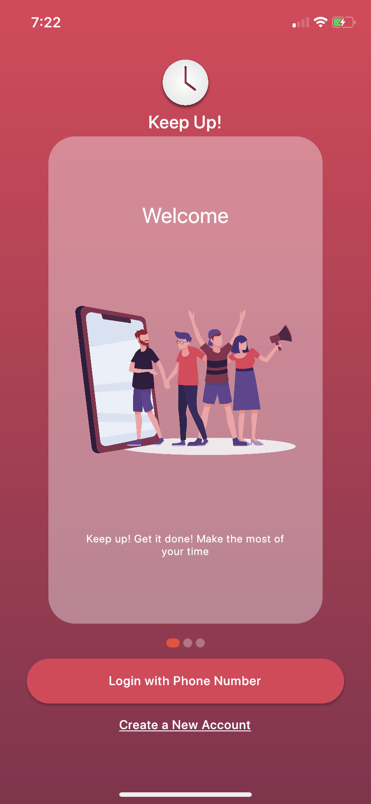
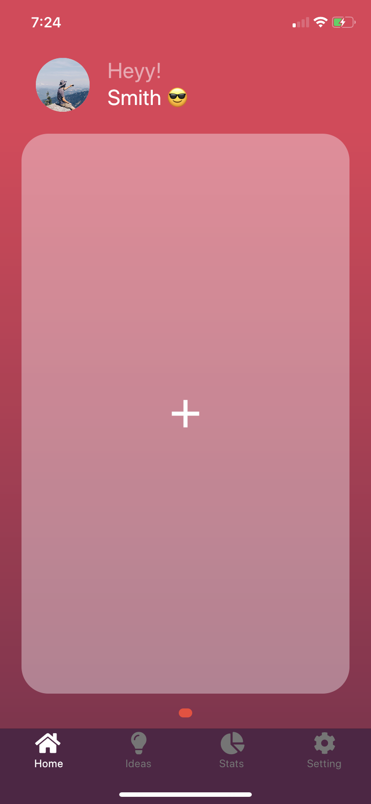
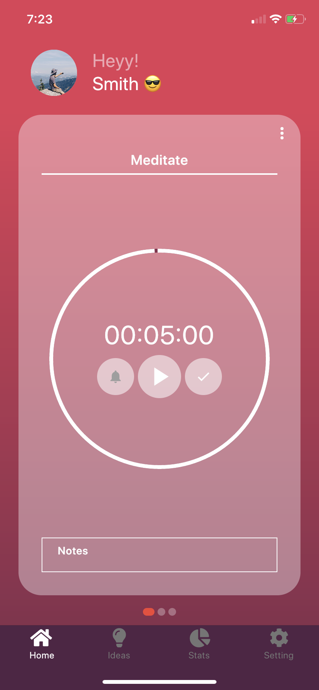
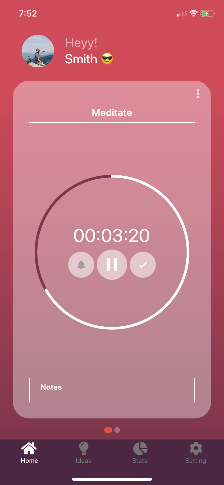
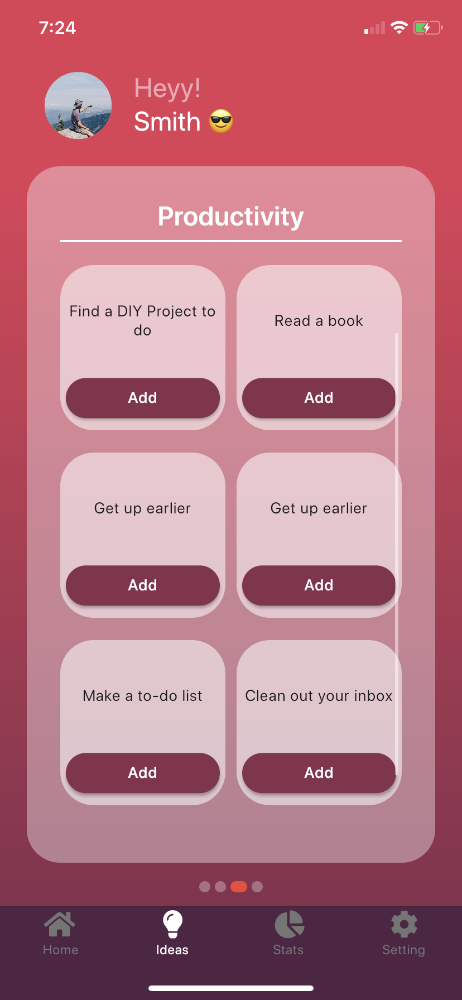
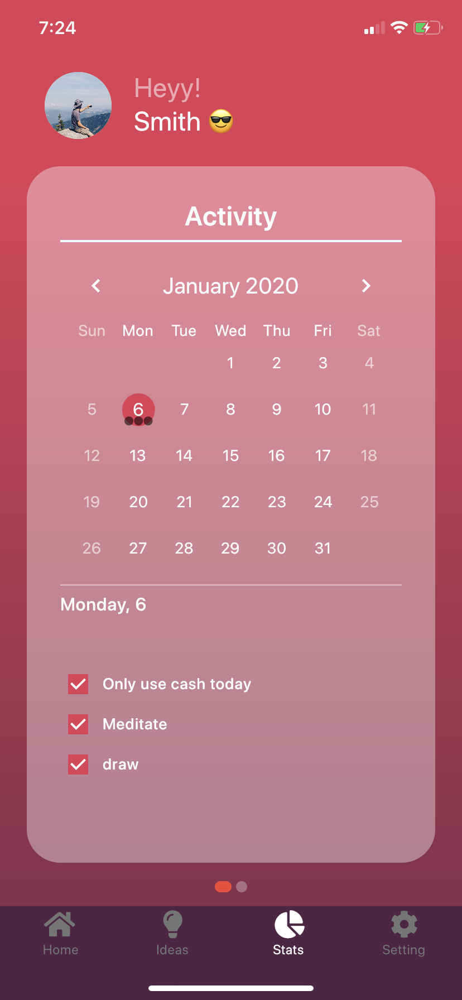

 
# Welcome ChallengeMeUp

 |  |
-----------------|----------
Android          |  
iOS              |  

This app allows you create and monitor your challenges. As we know, challenges motivate us, show who we are and what we are capable of. So, start using this app to be more productive by challenging yourself to be stronger and well-organized person.

### Screen Shots

Welcome page                 |Add a challenge                 | View challenge
:---------------------------:|:------------------------------:|:------------------------------:
      |   | 

View challenge               |  See challenge ideas           | Calender view of your challenges
:---------------------------:|:------------------------------:|:------------------------------:
      |           |  

### Support or Contact

Need to reach out to us? Contact us at challengemeup.dev@gmail.com and we’ll be happy to support you.
